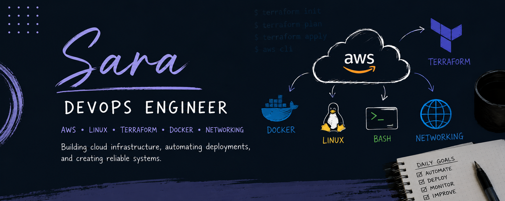

👋 Hi, I’m Sara

DevOps / Cloud Engineer (AWS • Terraform • Linux • Docker)
I build and automate cloud infrastructure using real-world DevOps practices and Infrastructure as Code.

🚀 About Me

I design and deploy cloud infrastructure using AWS, Terraform, Docker, and Linux.

I focus on building systems that are automated, scalable, and reliable, using hands-on projects that replicate real production environments.

🧠 What I’m Focused On
Cloud Infrastructure (AWS)
Infrastructure as Code (Terraform)
CI/CD & automation workflows
Linux system administration
Networking fundamentals
Containerization with Docker
Cloud security basics
🛠️ Tech Stack

📂 Featured Project — DevOps-Learning

A hands-on DevOps lab built to simulate real-world cloud infrastructure and automation workflows.

What it includes:
AWS VPC design (public and private subnets)
EC2 provisioning and configuration
Infrastructure as Code using Terraform
Docker container deployment
Linux server administration and automation
NGINX reverse proxy setup
Networking and troubleshooting labs
Purpose:

Built to practice real DevOps workflows and simulate production-grade cloud environments using automation and Infrastructure as Code.

🎯 Goal

To become a production-ready DevOps / Cloud Engineer capable of designing and automating scalable infrastructure in AWS.

💡 Mindset

“Good infrastructure is automated, repeatable, and reliable.”

